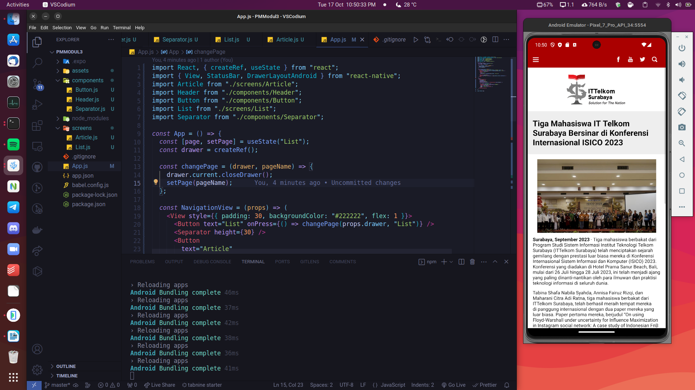

# Pemrograman Mobile - Modul 3: Core Component

| Nama | Ahmad Mu'min Faisal |
| -- | -- |
| NIM | 1203210101 |
| Kelas | IF-01-01 |

## 1. Pendahuluan

*Core component* / komponen utama React Native adalah komponen-komponen yang sudah disediakan oleh React Native secara bawaan (*built-in*). Sebagai contoh, *core component* dari React Native antara lain adalah `<View>`, `Text`, `<ScrollView`, `Button`, dan masih banyak lainnya.

## 2. Tujuan Praktikum

Tujuan dari praktikum ini adalah, antara lain:

1. mempelajari tentang *core component* yang dimiliki oleh React Native.
2. mengetahui bagaimana menggunakan komponen tersebut dalam membuat sebuah aplikasi mobile.

## 3. Gambaran Umum

Pada praktikum ini, akan dibuat aplikasi mobile untuk artikel di ITTelkom Surabaya. Tampilan dari aplikasi yang akan dibuat adalah sebagai berikut:


## 4. Langkah-Langkah Praktikum

### 4.1 Membuat dan Menjalankan Project React Native Menggunakan Expo

Untuk membuat project Expo, jalankan command berikut di terminal:

```bash
npx create-expo-app PMModul3
```

Setelah itu, akan ada folder baru bernama `PMModul3`. Masuk ke folder tersebut:

```bash
cd PMModul3
```

Pastikan emulator android (project ini menggunakan `Pixel_7_Pro_API_34`) telah berjalan:

```bash
QT_QPA_PLATFORM=xcb ~/Android/Sdk/emulator/emulator @{NAMA_EMULATOR}
```

Setelah itu, jalankan perintah berikut untuk menjalankan project Expo:

```bash
npm run android
```

Setelah semua perintah di atas dijalankan, maka aplikasi Expo akan berjalan di Emulator seperti pada dokumentasi berikut:


### 4.2 Menambahkan Asset

Assets merupakan file-file external yang dibutuhkan dalam pembuatan aplikasi. Asset yang digunakan dapat diunduh pada link [OneDrive](https://yptorid-my.sharepoint.com/personal/daud_ittelkom-sby_ac_id/_layouts/15/onedrive.aspx?ga=1&id=%2Fpersonal%2Fdaud%5Fittelkom%2Dsby%5Fac%5Fid%2FDocuments%2FMata%20Kuliah%2FPemrograman%20Mobile%2FMinggu%2005%2Fassets).

Setelah assets diunduh, extract file `~/Downloads/assets.zip`, kemudian pindahkan semua isinya ke direktori `assets` pada direktori root project `PMModul3`.

### 4.3 Menulis Source Code

#### 4.3.1 Komponen-Komponen

Buat direktori baru bernama `components` di root project untuk menyimpan file-file source code dari *custom component* React Native.

##### 4.3.1.1 Button

Komponen ini merupakan komponen tombol berwarna yang dibuat dari *core component* `<TouchableOpacity>`. Komponen ini memiliki child komponen `<Text>`.

Komponen ini memiliki isi dan event listener yang diambil dari `props` yang akan diberikan dari parent componentnya.


File `Button.js`:

```jsx
import React from "react";
import { TouchableOpacity, Text, StyleSheet } from "react-native";

const Button = (props) => {
  return (
    <TouchableOpacity style={styles.container} onPress={props.onPress}>
      <Text style={styles.text}>{props.text}</Text>
    </TouchableOpacity>
  );
};

const styles = StyleSheet.create({
  container: {
    backgroundColor: "#dddddd",
    padding: 15,
    alignItems: "center",
    borderRadius: 30,
  },
  text: {
    fontSize: 16,
    textTransform: "uppercase",
    fontWeight: "bold",
  },
});

export default Button;
```

##### 4.3.1.2 Header

Komponen ini adalah komponen header halaman berwarna merah yang dibuat dari komponen `<View>`. Komponen ini memiliki tombol yang dibuat dari komponen `<TouchableOpacity>` yang bertindak sebagai drawer yang akan membuka drawer ketika di-klik. Selain itu, komponen ini juga memiliki beberapa icon sebagai penghias, seperti icon Facebook, Youtube,Twitter, dan Search.

File `Header.js`:

```jsx
import React from "react";
import { View, TouchableOpacity, Image, StyleSheet } from "react-native";

const Header = (props) => {
  return (
    <View style={styles.header}>
      <TouchableOpacity onPress={() => props.drawer.current.openDrawer()}>
        <Image
          source={require("../assets/menu.png")}
          style={{ width: 18, height: 18 }}
        />
      </TouchableOpacity>
      <View>
        <View style={styles.iconsView}>
          <Image
            source={require("../assets/facebook.png")}
            style={styles.icons}
          />
          <Image
            source={require("../assets/youtube.png")}
            style={styles.icons}
          />
          <Image
            source={require("../assets/twitter.png")}
            style={styles.icons}
          />
          <Image
            source={require("../assets/search.png")}
            style={styles.icons}
          />
        </View>
      </View>
    </View>
  );
};

const styles = StyleSheet.create({
  header: {
    backgroundColor: "#AA0002",
    flexDirection: "row",
    justifyContent: "space-between",
    padding: 15,
  },
  stripeMenu: {
    width: 23,
    backgroundColor: "white",
    height: 3,
  },
  iconsView: {
    flexDirection: "row",
    alignItems: "center",
    justifyContent: "center",
  },
  icons: {
    width: 36,
    height: 16,
    resizeMode: "contain",
  },
});

export default Header;

```

##### 4.3.1.2 Separator

Komponen ini bertindak sebagai pemisah untuk komponen-komponen yang ada di Drawer.

File `Separator.js`:

```jsx
import React from "react";
import { View } from "react-native";

const Separator = (props) => {
  return <View style={{ height: props.height }}></View>;
};

export default Separator;

```

#### 4.3.2 Halaman-Halaman

Buat direktori baru bernama `screens` di root project untuk menyimpan file-file source code dari halaman pada aplikasi.

##### 4.3.2.1 List

Halaman ini merupakan komponen halaman List yang dibuat dari `<View>` yang merender data-data konten ITTelkom Surabaya. Konten-konten berasal dari data dummy yang tersimpan di variabel `data`.

File `List.js`:

```jsx
import React from "react";
import {
  FlatList,
  Image,
  Text,
  TouchableOpacity,
  View,
  StyleSheet,
} from "react-native";

const data = [
  {
    id: 1,
    title:
      "Tiga Mahasiswa IT Telkom Surabaya Bersinar di Konferensi Internasional ISICO 2023",
    image:
      "https://10tph8qrsp2c6.cdn.shift8web.com/wp-content/uploads/2023/09/ISICO-2023.jpg",
  },
  {
    id: 2,
    title:
      "Pentingnya Manajemen Konfigurasi dalam Rekayasa Perangkat Lunak dan Penerapannya",
    image:
      "https://10tph8qrsp2c6.cdn.shift8web.com/wp-content/uploads/2023/10/manajemen-konfigurasi.jpeg",
  },
  {
    id: 3,
    title: "Model-Model Software Development Life Cycle (SDLC)",
    image:
      "https://10tph8qrsp2c6.cdn.shift8web.com/wp-content/uploads/2023/10/software-development-life-cycle-.jpeg",
  },
  {
    id: 4,
    title: "Software Development Life Cycle (SDLC)",
    image:
      "https://10tph8qrsp2c6.cdn.shift8web.com/wp-content/uploads/2023/10/software-development-life-cycle.jpg",
  },
  {
    id: 5,
    title:
      "Sidang Terbuka Senat ITTelkom Surabaya Menyambut Dies Natalis ke-5, Pengukuhan Mahasiswa Baru dan PKKMB Dewangkara Maetala 2023",
    image:
      "https://10tph8qrsp2c6.cdn.shift8web.com/wp-content/uploads/2023/09/institut-teknologi-telkom-surabaya.jpg",
  },
  {
    id: 6,
    title:
      "Tiga Mahasiswa IT Telkom Surabaya Bersinar di Konferensi Internasional ISICO 2023",
    image:
      "https://10tph8qrsp2c6.cdn.shift8web.com/wp-content/uploads/2023/09/ISICO-2023.jpg",
  },
  {
    id: 7,
    title:
      "Pentingnya Manajemen Konfigurasi dalam Rekayasa Perangkat Lunak dan Penerapannya",
    image:
      "https://10tph8qrsp2c6.cdn.shift8web.com/wp-content/uploads/2023/10/manajemen-konfigurasi.jpeg",
  },
  {
    id: 8,
    title: "Model-Model Software Development Life Cycle (SDLC)",
    image:
      "https://10tph8qrsp2c6.cdn.shift8web.com/wp-content/uploads/2023/10/software-development-life-cycle-.jpeg",
  },
  {
    id: 9,
    title: "Software Development Life Cycle (SDLC)",
    image:
      "https://10tph8qrsp2c6.cdn.shift8web.com/wp-content/uploads/2023/10/software-development-life-cycle.jpg",
  },
  {
    id: 10,
    title:
      "Sidang Terbuka Senat ITTelkom Surabaya Menyambut Dies Natalis ke-5, Pengukuhan Mahasiswa Baru dan PKKMB Dewangkara Maetala 2023",
    image:
      "https://10tph8qrsp2c6.cdn.shift8web.com/wp-content/uploads/2023/09/institut-teknologi-telkom-surabaya.jpg",
  },
];

const List = () => {
  const renderItem = ({ item }) => {
    return (
      <TouchableOpacity style={styles.view} onPress={() => alert("Pressed")}>
        <View>
          <Image source={{ uri: item.image }} style={styles.image} />
          <Text style={styles.text}>{item.title}</Text>
        </View>
      </TouchableOpacity>
    );
  };

  return (
    <View style={{ paddingBottom: 100 }}>
      <FlatList
        data={data}
        renderItem={renderItem}
        keyExtractor={(item) => item.id}
      />
    </View>
  );
};

export default List;

const styles = StyleSheet.create({
  view: {
    padding: 15,
    borderBottomColor: "#dddddd",
    borderBottomWidth: 1,
  },
  image: {
    height: 200,
    width: null,
  },
  text: {
    fontSize: 18,
    paddingTop: 10,
  },
});

```

##### 4.3.2.2 Article

Halaman ini merupakan halaman artikel yang menampilkan 1 artikel dengan text panjang beserta gambar sebagai awalannya.

File `Article.js`:

```jsx
import React from "react";
import { ScrollView, Image, View, Text, StyleSheet, Alert } from "react-native";
import Separator from "../components/Separator";
import Button from "../components/Button";

const ButtonHandler = () => {
  Alert.alert("Button Handler");
};

const Article = () => {
  return (
    <ScrollView>
      <Image
        source={{
          uri: "https://ce.ittelkom-sby.ac.id/wp-content/uploads/2020/09/WhatsApp-Image-2018-04-18-at-11.47.40-AM-1024x564-1.png",
        }}
        style={styles.logo}
      />
      <View style={styles.titleView}>
        <Text style={styles.title}>
          Tiga Mahasiswa IT Telkom Surabaya Bersinar di Konferensi Internasional
          ISICO 2023
        </Text>
      </View>
      <View style={styles.content}>
        <Image
          source={{
            uri: "https://10tph8qrsp2c6.cdn.shift8web.com/wp-content/uploads/2023/09/ISICO-2023.jpg",
          }}
          style={styles.mainImage}
        />
        <Separator height={10} />
        <Text>
          <Text style={{ fontWeight: "bold" }}>Surabaya, September 2023</Text> -
          Tiga mahasiswa berbakat dari Program Studi Sistem Informasi Institut
          Teknologi Telkom Surabaya (ITTelkom Surabaya) telah menciptakan
          sejarah gemilang dengan prestasi luar biasa mereka di Konferensi
          Internasional Sistem Informasi dan Komputer (ISICO) 2023. Konferensi
          yang diadakan di Hotel Prama Sanur Beach, Bali, mulai dari 26 Juli
          hingga 28 Juli 2023, ini telah menjadi ajang yang paling
          dinanti-nantikan oleh para ilmuwan dan praktisi teknologi informasi di
          seluruh dunia.
        </Text>
        <Separator height={10} />
        <Text>
          Tabina Shafa Nabila Syahda, Annisa Fairuz Rizqi, dan Maharani Citra
          Adi Ratna, tiga mahasiswa berbakat dari ITTelkom Surabaya, telah
          berhasil meraih tempat mereka di panggung internasional dengan dua
          paper mereka yang luar biasa. Paper pertama mereka, berjudul “On using
          Floyd-Warshall under uncertainty for Influence Maximization in
          Instagram social network: A case study of Indonesian FnB unicorn
          company,” dan paper kedua mereka, yang berjudul “Malaysia Citizen
          Sentiment on Government Response Towards Covid-19 Disaster Management:
          Using LDA-based Topic Visualization on Twitter,” telah diterima oleh
          panitia ISICO 2023 untuk dipresentasikan dalam sesi konferensi yang
          bergengsi.
        </Text>
        <Separator height={10} />
        <Text>
          Prestasi ini tak lepas dari bimbingan dan dukungan penuh dari seorang
          dosen hebat, Mochammad Nizar Palefi Ma’ady, S.Kom, M.Kom. Dengan
          bimbingan dan dorongan dari dosen mereka, para mahasiswa ini berhasil
          mengatasi persaingan sengit di tingkat internasional dan membuktikan
          bahwa mereka adalah calon-calon terbaik dalam dunia riset teknologi
          informasi.
        </Text>
        <Separator height={10} />
        <Text>
          Konferensi ISICO 2023 adalah platform internasional yang menarik bagi
          para ahli, peneliti, dan praktisi di bidang teknologi informasi. Ini
          adalah acara yang memberi mereka kesempatan untuk berbagi pengetahuan,
          ide, dan terobosan terbaru dalam perkembangan teknologi informasi.
          Kehadiran tiga mahasiswa IT Telkom Surabaya di sini adalah bukti bahwa
          Indonesia memiliki potensi besar dalam arena ini dan dapat bersaing di
          tingkat global.
        </Text>
        <Separator height={10} />
        <Text>
          Prestasi luar biasa yang diraih oleh Tabina Shafa Nabila Syahda,
          Annisa Fairuz Rizqi, dan Maharani Citra Adi Ratna, bersama dengan
          bimbingan yang luar biasa dari dosen mereka, adalah bukti nyata dari
          komitmen ITTelkom Surabaya dalam mendukung pengembangan potensi
          akademik dan penelitian mahasiswa. Universitas ini terus berfokus pada
          pembelajaran inovatif dan penelitian berkualitas tinggi, dan kehadiran
          mereka di ISICO 2023 hanya meningkatkan reputasi kampus ini sebagai
          salah satu lembaga pendidikan terkemuka di Indonesia.
        </Text>
        <Separator height={10} />
        <Text>
          Prestasi ini tidak hanya membanggakan bagi mahasiswa dan kampus
          mereka, tetapi juga bagi Indonesia secara keseluruhan. Ini adalah
          langkah penting dalam membuktikan bahwa anak-anak muda Indonesia
          memiliki bakat dan kemampuan untuk bersaing di panggung global,
          khususnya dalam bidang teknologi informasi yang terus berkembang.
          Semoga prestasi ini menjadi inspirasi bagi generasi mendatang untuk
          mengejar mimpi mereka dan mengejar keunggulan dalam dunia akademik dan
          penelitian.
        </Text>
        <Separator height={10} />
        <Text style={{ fontWeight: "bold" }}>SEPTEMBER, 2023 </Text>
        <Separator height={10} />
        <View style={{ backgroundColor: "gray", height: 1 }} />
        <Separator height={20} />
        <Button text="Share" onPress={ButtonHandler} />
        <Separator height={70} />
      </View>
    </ScrollView>
  );
};

export default Article;

const styles = StyleSheet.create({
  logo: {
    height: 100,
    resizeMode: "contain",
    marginVertical: 15,
  },
  titleView: {
    paddingHorizontal: 15,
    paddingVertical: 20,
    backgroundColor: "#eeeeee",
  },
  title: {
    fontSize: 24,
    fontWeight: "bold",
  },
  mainImage: {
    height: 220,
    resizeMode: "contain",
  },
  content: {
    padding: 15,
  },
});

```

#### 4.3.2 App.js

File ini merupakan root component yang akan dijalankan oleh React Native. Aplikasi ini menampilkan halaman utama dengan komponen `Header` beserta dengan halaman `List` sebagai halaman yang pertama kali ditampilkan. Ketika drawer dibuka dan tombolnya di-klik, maka user dapat berganti-ganti halaman baik ke halaman `List` atau `Article`, atau menutup drawernya.

File `App.js`:

```jsx
import React, { createRef, useState } from "react";
import { View, StatusBar, DrawerLayoutAndroid } from "react-native";
import Article from "./screens/Article";
import Header from "./components/Header";
import Button from "./components/Button";
import List from "./screens/List";
import Separator from "./components/Separator";

const App = () => {
  const [page, setPage] = useState("List");
  const drawer = createRef();

  const changePage = (drawer, pageName) => {
    drawer.current.closeDrawer();
    setPage(pageName);
  };

  const NavigationView = (props) => (
    <View style={{ padding: 30, backgroundColor: "#222222", flex: 1 }}>
      <Button text="List" onPress={() => changePage(props.drawer, "List")} />
      <Separator height={30} />
      <Button
        text="Article"
        onPress={() => changePage(props.drawer, "Article")}
      />
      <Separator height={30} />
      <Button text="Close" onPress={() => props.drawer.current.closeDrawer()} />
    </View>
  );

  return (
    <DrawerLayoutAndroid
      ref={drawer}
      drawerWidth={300}
      drawerPosition="left"
      renderNavigationView={() => <NavigationView drawer={drawer} />}
    >
      <View style={{ paddingTop: 0 }}>
        <StatusBar style="auto" backgroundColor="#AA0002" />
        <Header drawer={drawer} />
        {page == "List" && <List />}
        {page == "Article" && <Article />}
      </View>
    </DrawerLayoutAndroid>
  );
};

export default App;

```

## 5. Dokumentasi

### 5.1 Halaman List


### 5.2 Halaman Article



### 5.3 Drawer


### 5.4 Alert Dialog


